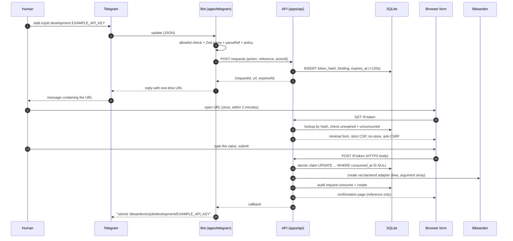
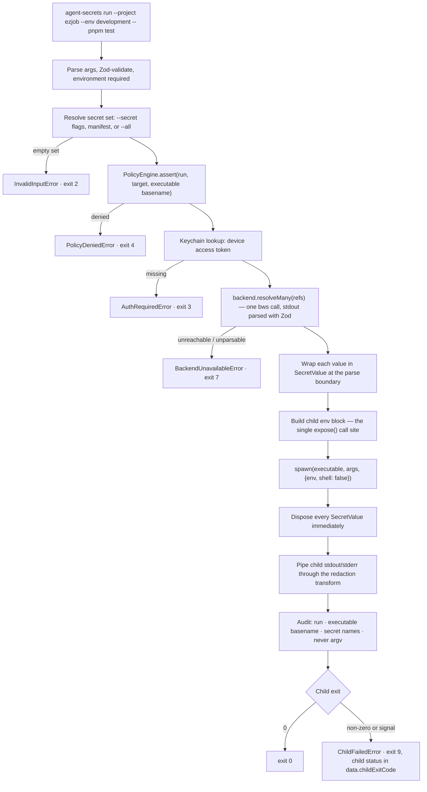

# Architecture

How Agent Secrets is put together, and — more importantly — why a raw value cannot
cross most of the arrows in these diagrams.

> **Status.** `@bx-labs/agent-secrets-core` is implemented. Everything else described
> here is designed and specified but **planned**. See [`ROADMAP.md`](../ROADMAP.md).

---

## 1. Components

```
┌──────────────────────────────────────────────────────────────────────────────┐
│                              trusted local machine                           │
│                                                                              │
│   ┌────────────────┐        ┌──────────────────────────────────────────┐     │
│   │  agent-secrets │        │  agent-secrets-mcp                       │     │
│   │  CLI           │◀──────▶│  (stdio MCP server, 7 tools, no values)   │◀────┼── agent
│   └───────┬────────┘        └──────────────────────────────────────────┘     │
│           │                                                                  │
│           ├── policy engine ──── deny by default, enforced in code           │
│           ├── redaction ──────── stream transform + canary tripwires         │
│           └── audit sink ─────── JSONL, 0600, append-only                    │
│                       │                                                      │
│           ┌───────────┴───────────┐         ┌─────────────────────────┐      │
│           │ backend-bitwarden     │────────▶│ macOS Keychain          │      │
│           │ (bws subprocess)      │  token  │ device access token     │      │
│           └───────────┬───────────┘         └─────────────────────────┘      │
└───────────────────────┼──────────────────────────────────────────────────────┘
                        │ HTTPS
                        ▼
            ┌──────────────────────────┐
            │ Bitwarden Secrets Manager│
            └──────────────────────────┘
                        ▲
                        │ HTTPS (backend adapter, server side)
┌───────────────────────┼──────────────────────────────────────────────────────┐
│                       │           your own single-tenant host                 │
│   ┌───────────────────┴────────┐         ┌────────────────────────────────┐   │
│   │ apps/api  (Fastify)        │◀────────│ apps/telegram (grammY)         │   │
│   │  · one-time request store  │  create │  · numeric-id allowlist        │   │
│   │  · secure input form       │ request │  · Zod-validated updates       │   │
│   │  · SQLite: requests, audit │         │  · metadata commands only      │   │
│   └───────────────▲────────────┘         └───────────────┬────────────────┘   │
└───────────────────┼──────────────────────────────────────┼────────────────────┘
                    │ HTTPS form POST                      │ Bot API
              ┌─────┴──────┐                        ┌──────┴──────┐
              │  browser   │                        │  Telegram   │
              │  (human)   │                        │  (metadata) │
              └────────────┘                        └─────────────┘
```

### Responsibilities

| Component | Owns | Explicitly does not |
| --- | --- | --- |
| `@bx-labs/agent-secrets-core` | Reference grammar, sanitized errors and exit-code mapping, metadata and audit schemas, the `SecretBackend` contract, the policy engine, value rules, `SecretValue`. | Any I/O. It has no filesystem, network, or subprocess code at all. |
| `@bx-labs/agent-secrets-redaction` | Stream transforms that replace registered values with `[secret]`; canary generation and detection for tests. | Guaranteeing redaction against an adversarial child (see §7). |
| `@bx-labs/agent-secrets-backend-bitwarden` | Locating and invoking `bws` with argument arrays, parsing its stdout with Zod, mapping every failure to a sanitized error, wrapping values in `SecretValue` at the parse boundary, the Keychain adapter. | Deciding whether an operation is allowed. That is the policy engine's job. |
| `@bx-labs/agent-secrets` (CLI) | Argument parsing, policy assertion, the JSON envelope, the JSONL audit sink, manifest and policy loading, child process spawning and environment injection. | Storing anything secret. Its config directory holds no credential. |
| `@bx-labs/agent-secrets-mcp` | Exposing metadata and controlled execution to agents; request creation without ever returning the resulting link. | Returning a value. There is no code path that can. |
| `apps/api` | One-time request lifecycle, the secure input form, the atomic claim, server-side audit, the backend write. | Persisting a value. The SQLite schema has no value column in any migration. |
| `apps/telegram` | Allowlist enforcement, command parsing, rate limiting, handing back a link. | Receiving, holding, or forwarding a value. |

### Why the core has no I/O

Every security invariant that can be expressed as a pure function lives in
`packages/core`: what a valid reference looks like, what an error may say, which
fields a payload may carry, what the policy answer is. Those are the properties we
most want to test exhaustively and least want coupled to a filesystem. The result is
that a reviewer auditing "can this leak?" reads one small package with no ambient
authority, and then checks that every other package routes through it.

---

## 2. Data flow: a Telegram-initiated `add`

The flow that defines the product. The human types a value into a browser form; the
bot, the chat, the agent and the CLI never see it.



Step by step, with the reason each step exists:

1. **The human sends `/add <project> <environment> <NAME>` in Telegram.** The command
   carries a reference and nothing else. There is no command that accepts a value.
2. **The bot validates the update against a Zod schema and checks the sender's numeric
   Telegram user id against the allowlist.** An unknown sender gets a generic refusal
   and the command is not parsed further — an unauthenticated user should not be able
   to probe which projects exist.
3. **The bot parses the reference with `parseRef`.** A missing environment is an error
   here, not a defaulted `production`. A malformed name is rejected before it can
   reach a subprocess argument or an HTML template.
4. **The bot asks the policy engine whether `request-create` is allowed** for that
   project and environment. Denied stops the flow here and records a `denied` audit
   event. The agent, the human and the bot cannot argue with this; it is code.
5. **The bot calls the API's request-creation endpoint** over an authenticated
   server-to-server channel, passing the action, the reference, and the opaque actor
   id. No value exists yet anywhere in the system.
6. **The API mints the token**: at least 256 bits from `crypto.randomBytes`. It stores
   only a SHA-256 hash of that token, together with the binding
   (actor, backend, project, environment, name, action), an `expires_at` two minutes
   ahead, and a `consumed_at` that is `NULL`. **The token itself is never written to
   the database**, so a database read does not yield a usable link.
7. **The API returns the one-time URL.** The plaintext token exists in exactly two
   places: this response, and the URL in the human's hands.
8. **The bot replies with the URL and a one-line caption.** It does not ask for a
   value in chat, and it never will — there is no code path that reads a message body
   as a value.
9. **The human opens the URL.** The API hashes the presented token, looks up the row,
   and checks that it is unexpired and unconsumed. It renders a minimal form that
   displays the reference (so the human can confirm what they are filling in) with a
   strict CSP forbidding external resources, `Cache-Control: no-store`,
   `Referrer-Policy: no-referrer`, autocomplete disabled, and an anti-CSRF token bound
   to the request row.
10. **The human types the value and submits over HTTPS.** The body is parsed at the
    boundary and immediately wrapped in `SecretValue`; the raw string is never
    assigned to anything that outlives the handler frame. Value rules apply here
    exactly as they do at the CLI prompt.
11. **The API claims the request atomically** — a single
    `UPDATE one_time_requests SET consumed_at = ? WHERE id = ? AND consumed_at IS NULL
    AND expires_at > ?`. Zero rows affected means expired or already used, which is
    `EXPIRED_OR_CONSUMED` / exit 8 and no backend call. One row affected means this
    submission is the only one that will ever succeed for this link. Only then does
    the API call the backend adapter, which spawns `bws` with an argument array.
12. **The API disposes of the `SecretValue`, writes `request-consume` and `create`
    audit events (metadata only), returns a confirmation page showing the reference,
    and calls back to the bot,** which posts the reference to the chat. The value's
    entire life was: browser → HTTPS body → `SecretValue` → backend adapter →
    Bitwarden.

### Why the value never crosses certain boundaries

- **It never enters the Telegram message stream** because no command accepts one. A
  value pasted into the chat is not "handled badly" by the bot — it is a different
  event, covered in [`telegram-security.md`](telegram-security.md), and it means the
  value is already exposed on Telegram's side.
- **It never enters the model context** because the MCP request tools return a request
  id and an expiry, and the link is delivered out of band to the human's Telegram.
  An agent that can read the tool result still cannot open the form.
- **It never enters the database** because there is no column for it. This is a
  schema-level guarantee, not a discipline-level one.
- **It never enters a log** because every sink runs `assertNoValueFields` first and
  the metadata schemas are `.strict()`. See [`logging.md`](logging.md).
- **It never enters a process argument** at the CLI: `add` and `rotate` have no
  `--value` flag, and the prompt is a hidden TTY read.

---

## 3. Data flow: `agent-secrets run`



Three details that matter more than they look:

- **`resolveMany` is batch-only.** There is deliberately no `resolveOne` on
  `SecretBackend`, because a single-secret read API makes "resolve one and print it"
  an easy thing to write, and we would rather it be an awkward thing to write.
- **Disposal happens at spawn time, not at exit.** The parent holds the value for the
  duration of one `spawn` call and no longer. The child keeps its own copy in its
  environment; that is the trade the command exists to make.
- **`run` exits 9, it does not forward the child's status.** Exit codes 2–10 belong to
  this tool. If the CLI forwarded a child's exit code 4, a caller could not distinguish
  "policy denied" from "the child returned 4". The child's real status is reported in
  the JSON envelope as `data.childExitCode` and `data.signal`.

---

## 4. The backend abstraction contract

```ts
interface SecretBackend {
  readonly id: string;
  health(): Promise<BackendHealth>;
  list(scope: SecretScope): Promise<SecretMetadata[]>;
  describe(ref: SecretRef): Promise<SecretMetadata | null>;
  create(ref: SecretRef, value: SecretValue, metadata?: InputMetadata): Promise<SecretMetadata>;
  update(ref: SecretRef, value: SecretValue): Promise<SecretMetadata>;
  delete(ref: SecretRef): Promise<void>;
  resolveMany(refs: SecretRef[]): Promise<ResolvedSecret[]>;
}
```

Obligations on every implementation:

1. **Map every failure to an `AgentSecretsError`** with a stable code. Never re-throw
   a raw backend or `spawn` error: its message can embed the value or the access
   token. The original throwable may ride on `cause` for local debugging and is never
   rendered by any sink.
2. **Never log a raw backend response from a value-bearing operation.** Metadata
   responses may be logged; `resolveMany` output may not, at any verbosity.
3. **Return `SecretValue` instances from `resolveMany`,** never plain strings. The
   wrapping happens at the parse boundary so that no plain string with a value in it
   ever exists in adapter code beyond that line.
4. **`describe` on a missing record returns `null`,** not an error. "Does this exist?"
   is a legitimate question with two ordinary answers.
5. **Parse backend stdout with a Zod schema.** This is a security control: it stops a
   malformed or hostile response from becoming an unexpected shape downstream.
6. **Spawn with argument arrays and no shell,** with a timeout and an output size cap.

### V1: Bitwarden Secrets Manager

- Driven through the official `bws` CLI in a hardened subprocess.
- One Bitwarden project holds all records for a deployment; the canonical
  `project/environment/name` scope is encoded into the Bitwarden secret **key**, so
  the addressing survives a round-trip with no side table to keep in sync.
- The device access token is read from the macOS Keychain at call time and passed to
  the subprocess through its environment — never written to a file, never placed in an
  argument.

> **Open implementation question, recorded here rather than hidden.** The adapter must
> hand a value to `bws` on write. If the `bws` interface only accepts the value as a
> command-line argument, the value is briefly visible in the process table of that
> machine. Whoever completes `packages/backend-bitwarden` must determine what `bws`
> actually supports, choose the least-exposing option, and record the outcome in
> [`threat-model.md`](threat-model.md) as either a mitigation or an accepted residual
> risk. It must not ship undocumented.

---

## 5. Data model

### 5.1 One-time requests — planned

```sql
CREATE TABLE one_time_requests (
  id            TEXT    PRIMARY KEY,          -- req_<uuid>
  token_hash    BLOB    NOT NULL UNIQUE,      -- SHA-256 of the token; the token is never stored
  action        TEXT    NOT NULL,             -- 'create' | 'rotate' | 'delete'
  backend       TEXT    NOT NULL,
  project       TEXT    NOT NULL,
  environment   TEXT    NOT NULL,             -- development | preview | production
  name          TEXT    NOT NULL,
  actor_type    TEXT    NOT NULL,             -- 'telegram' | 'human' | 'agent'
  actor_id      TEXT    NOT NULL,             -- opaque; Telegram numeric user id
  created_at    TEXT    NOT NULL,
  expires_at    TEXT    NOT NULL,             -- created_at + 120s
  consumed_at   TEXT,                         -- NULL until the atomic claim succeeds
  attempts      INTEGER NOT NULL DEFAULT 0
);

CREATE INDEX idx_requests_expiry ON one_time_requests (expires_at);
```

There is **no value column, and there never was one in any migration.** A future
migration that adds one is a rejected pull request, not a design change.

The claim is one statement:

```sql
UPDATE one_time_requests
   SET consumed_at = :now
 WHERE id = :id
   AND consumed_at IS NULL
   AND expires_at > :now;
```

Zero rows affected → `EXPIRED_OR_CONSUMED` / exit 8, and no backend call happens.
One row affected → this submission is the only one that will ever succeed. Because
SQLite serialises writes, two concurrent submissions cannot both win.

Lookup is by `token_hash`, so a read of the database yields no usable link. Expired
rows are swept periodically; sweeping is a tidiness measure, not a security control —
the `expires_at` predicate in the claim is what enforces the TTL.

### 5.2 Audit events

The same shape everywhere, defined once in the core:

```jsonc
{
  "id": "evt_0f3c9c9e5f2a4f0bb0a1f2d3c4b5a697",
  "timestamp": "2026-08-16T10:24:31.117Z",
  "actorType": "telegram",
  "actorId": "<opaque actor id>",
  "deviceId": "<device id>",
  "operation": "create",
  "reference": "bitwarden/ezjob/development/EXAMPLE_API_KEY",
  "secretNames": ["EXAMPLE_API_KEY"],
  "commandExecutable": "pnpm",
  "outcome": "success",
  "durationMs": 412
}
```

- The schema is `.strict()`, so an added `value`, `hash` or `preview` field fails to
  parse rather than shipping.
- `buildAuditEvent` runs `assertNoValueFields` before parsing — belt and braces, in
  case someone legitimises a forbidden key by adding it to the schema.
- `commandExecutable` is the **basename only**. The argument vector routinely carries
  tokens and is never recorded.
- The CLI sink writes JSONL at `0600` under the user's config directory, deliberately
  avoiding a native dependency in a globally installed package. The API sink writes
  rows to SQLite. Both implement the same `AuditSink` interface, so the no-value
  assertion happens in exactly one place.

---

## 6. Trust boundaries

```
   ┌─────────────────────────────────────────────────────────────────┐
   │ B1  Human ↔ browser form            value crosses (HTTPS)       │
   ├─────────────────────────────────────────────────────────────────┤
   │ B2  API ↔ Bitwarden                 value crosses (adapter)     │
   ├─────────────────────────────────────────────────────────────────┤
   │ B3  CLI ↔ child process             value crosses (env block)   │
   ├═════════════════════════════════════════════════════════════════┤
   │ B4  Bot ↔ Telegram                  metadata + one-time URL     │
   │ B5  MCP server ↔ agent              metadata + redacted output  │
   │ B6  CLI/API ↔ audit + logs          metadata only               │
   │ B7  Repository ↔ git                references only             │
   │ B8  Bot ↔ API                       references + actor id       │
   └─────────────────────────────────────────────────────────────────┘
```

B1–B3 are the three crossings named in `CLAUDE.md`. B4–B8 carry metadata only, by
construction rather than by convention: schemas are `.strict()`, results run through
`assertNoValueFields`, and `SecretValue.toJSON()` throws rather than emitting a
placeholder — because a serializer reaching a value is a defect we want loud in a
test, not quietly masked in production.

The full adversary-by-adversary analysis is in [`threat-model.md`](threat-model.md),
including the parts where we do not protect you.
